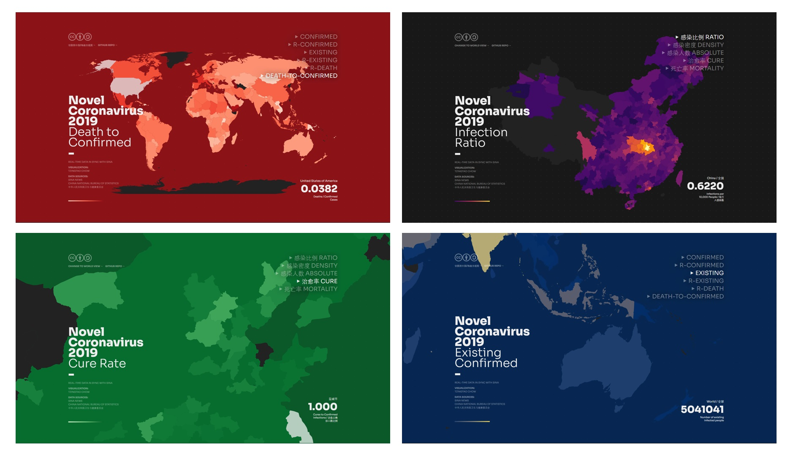

# nCoVis Choropleth

### About

Visualization of the Novel Coronavirus outbreak in Wuhan, China. 

Compared with other existing visualization projects for nCoV-2019, nCoVis Choropleth collects and visualizes data of prefecture-level cities (instead of provinces), as well as other indicators such as infection density (infections per km²) and infection ratio (%).

Note that this project is still in the experimental stage. Additional modules are under development.



### Start Building

```sh
# Development

npm i
npm install -g parcel-bundler
parcel index.html

# Production Build & Deployment

parcel build index.html --public-url "."
# For publishing on github pages, relative path configuration is required.
git subtree push --prefix dist origin gh-pages
```


