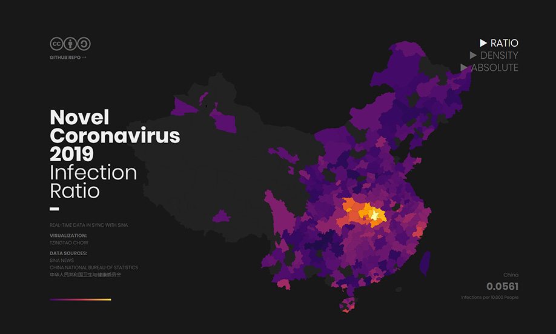
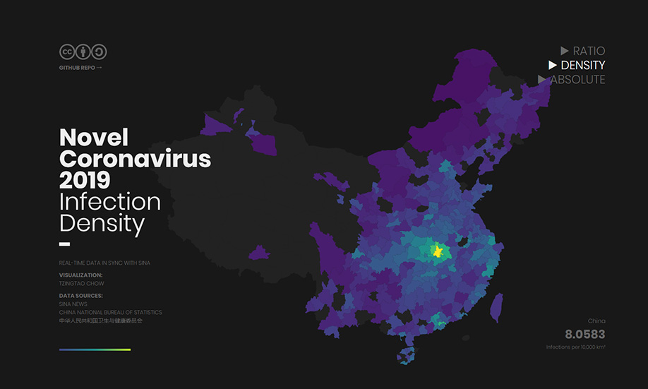
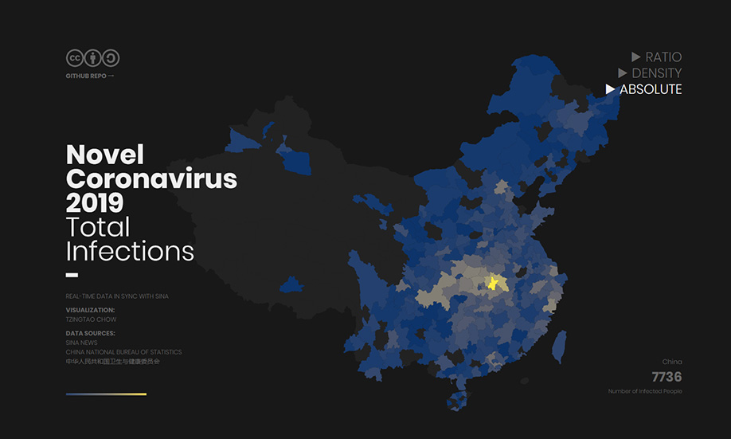

# nCoVis Source Code

Visualization of the Novel Coronavirus outbreak in Wuhan, China. 

Compared with other existing visualization projects for nCoV-2019, nCoVis collects and visualizes data of prefecture-level cities (instead of provinces), as well as other indicators such as infection density (infections per km²) and infection ratio (%).

Note that this project is still in the experimental stage. Additional modules are under development.

